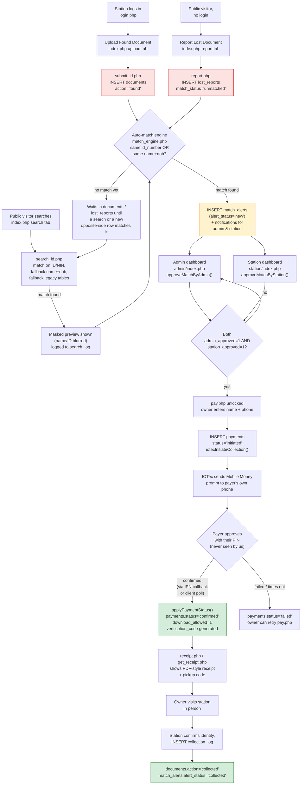
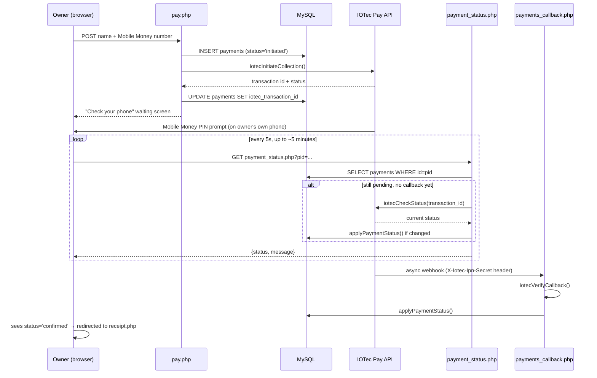

# iRecovery Uganda

**iRecovery** is a PHP/MySQL web platform that helps people in Uganda recover lost official
documents — National IDs, Driving Permits, Passports, Student IDs, Academic Documents, Land
Titles, Birth Certificates, and other documents found by partner radio stations, police posts,
and other collection points.

A member of the public can search a database of found documents, get matched to a lost report,
pay a small recovery fee by Mobile Money, and collect the document from the station holding it.
Stations and admins manage the whole pipeline from two separate dashboards.

Live production site: `https://id.faithfellows.online/`
Local dev URL: `http://localhost/irecover-new/`

---

## Tech stack

- **Backend:** PHP 8.2, procedural style, no framework
- **Database:** MySQL/MariaDB via `mysqli` with prepared statements everywhere
- **Frontend:** Bootstrap 5.3, Bootstrap Icons, Google Fonts (Inter), vanilla JS (no JS framework)
- **Server:** Apache via XAMPP (Windows)
- **Payments:** [IOTec Pay](https://pay.iotec.io/api-docs/index.html) — real Mobile Money
  collections (MTN/Airtel) via OAuth2 client-credentials + a Collections API, with an IPN
  callback for async confirmation
- **Sessions:** native PHP sessions, one session key per role (see below)
- No package manager / build step — there's no `composer.json` or `npm` involved. You edit PHP
  files and refresh the browser.

---

## Directory structure

```
irecover-new/
├── index.php              Public homepage — Upload Found / Report Lost / Search tabs
├── login.php               Station login              → $_SESSION['station_user']
├── adminlogin.php           Admin / Super Admin login   → $_SESSION['admin_user']
├── submit_id.php            Handles "Upload Found Document" POST
├── report.php                Handles "Report Lost Document" POST
├── search_id.php              Handles the public document search POST
├── track.php                   Public status tracker (search by ID/NIN)
├── pay.php                      Pay-to-recover flow (IOTec Mobile Money collection)
├── payments_callback.php         IOTec IPN/callback endpoint (server-to-server)
├── payment_status.php             JSON polling endpoint used by pay.php while waiting
├── get_receipt.php                 Look up an already-paid receipt by ID/NIN
├── receipt.php                      Renders/downloads the PDF-style receipt + pickup code
├── success.php                       Static legacy "ID found" demo page (not wired into the flow)
├── db.php                             DB connection bootstrap (see Configuration below)
├── admin/
│   ├── index.php                      Admin / Super Admin dashboard
│   ├── user_saver.php                 AJAX endpoint: add a new station (super admin only)
│   └── logout.php
├── station/
│   ├── index.php                      Station dashboard
│   └── logout.php
├── includes/
│   ├── match_engine.php               All shared business logic (see below)
│   └── iotec_pay.php                  IOTec Pay HTTP client
├── assets/css/                        variables.css, base.css, home.css, login.css, dashboard.css, feedback.css
├── img/                                Static images (bg.jpg, etc.)
├── uploads/                            Document photos + police letters uploaded by users
├── database/
│   └── u850523537_iRecover_DB.sql     Full schema + seed/sample data dump
├── db.local.php.example                Template for production DB credential overrides
├── payments.local.php.example          Template for production IOTec Pay credentials
├── robots.txt / sitemap.xml            SEO
└── MASTER_PROMPT.md                    Original spec/build brief used to prompt AI coding tools
```

`db.local.php` and `payments.local.php` are **git-ignored** — they hold real credentials on the
production server and are never committed. Locally, their absence just means `db.php` falls back
to XAMPP's defaults (`root` / no password / `irecover` database) and `iotec_pay.php` falls back
to empty credentials (any Mobile Money collection call will throw `IotecPayException` until you
add a local `payments.local.php`).

---

## User roles & access

| Role | Session key | Login page | Dashboard | Notes |
|---|---|---|---|---|
| Super Admin | `$_SESSION['admin_user']` | `adminlogin.php` | `admin/index.php` | Everything Admin can do, plus: add stations, edit recovery fees, approve the *station* side of a match on a station's behalf |
| Admin | `$_SESSION['admin_user']` | `adminlogin.php` | `admin/index.php` | Approve matches (admin side), manage documents/alerts/payments, mark items collected |
| Station | `$_SESSION['station_user']` | `login.php` | `station/index.php` | Upload found documents, approve matches (station side), confirm collection/hand-over |
| Public | none | — | `index.php` | Search, report a lost document, pay, track status, get receipt |

Role lives in `admins.role` (`enum: 'super_admin' | 'admin' | 'station'`) — the `admins` table
serves **all** logged-in users, not just station partners. Every protected page starts with an
auth guard:

```php
// admin/*.php
if (!isset($_SESSION['admin_user'])) { header('Location: ../adminlogin.php'); exit(); }

// station/*.php
if (!isset($_SESSION['station_user'])) { header('Location: ../login.php'); exit(); }
```

Passwords are `password_hash()`/`password_verify()` going forward. A few legacy accounts still
have plaintext passwords in the DB — both login pages detect a plaintext match with
`hash_equals()` and silently upgrade it to a bcrypt hash on that successful login, so old station
accounts keep working without a manual migration step.

---

## Complete system flow

There are two independent starting points — a **found** document and a **lost** report — that
the match engine reconciles into one case, which then moves through approval, payment, and
collection. The diagram below is the whole journey; the walkthroughs and sequence diagram after
it fill in the detail.



At any point after a case exists, the owner (or anyone with the ID/NIN) can check
`track.php?id_number=...` — a public, login-free page that reports exactly which of these stages
the case is currently sitting in (`awaiting_admin` → `awaiting_station` → `ready_to_pay` →
`payment_in_progress` → `ready_for_pickup` → `collected`).

### 1. Station finds a document

- Logs in at `login.php` → `station/index.php`.
- Uploads it via the homepage's "Upload Found Document" tab (Document Type, owner details,
  front/back photos) → POSTs to `submit_id.php`.
- `submit_id.php` saves the photos into `uploads/` and inserts a row into `documents`
  (`action='found'`, `reporter` / `station_holding` = the station's username), then calls
  `checkMatchOnUpload()` to see if a matching lost report already exists.

### 2. Someone reports their document lost

- No login required — homepage's "Report Lost Document" tab (Document Type, owner details, DOB,
  police letter upload, reporter phone/email) → POSTs to `report.php`.
- Inserts into `lost_reports` (`match_status='unmatched'`), then calls `checkMatchOnReport()` to
  see if a matching found document already exists, and notifies admins of the new report either way.

### 3. Someone searches for their document

- No login required — homepage's "Search for Document" tab → POSTs to `search_id.php`.
- Matches on ID/NIN first, falls back to surname + given name + DOB, and — if nothing is found in
  the unified `documents` table — also checks the legacy `national_ids` / `driving_permits` /
  `student_ids` tables so old data stays searchable.
- A match renders a **blurred** document photo and a **masked** name/ID (e.g. `NA**** ES****`,
  `CM94********TZ`) — nothing identifying is revealed pre-payment. Every attempt (matched or not)
  is logged to `search_log`, and `ensureMatchAlertForSearch()` creates or reuses a `match_alerts`
  row so this becomes a trackable case even if the owner never filed a formal lost report.

### 4. The match engine reconciles found ↔ lost

`includes/match_engine.php` is where all of this shared logic lives — it's included by nearly
every entry point above:

- `checkMatchOnUpload()` / `checkMatchOnReport()` — run automatically right after an insert, look
  for the same case on the opposite side, and create the `match_alerts` + `notifications` rows.
- `ensureMatchAlertForSearch()` — same idea, triggered by a successful public search instead of a
  formal report.
- `approveMatchByAdmin()` / `approveMatchByStation()` — flip the two independent approval flags.
- `tryActivatePaymentPending()` — moves `alert_status` to `payment_pending` once both approvals
  are in.
- `applyPaymentStatus()` — the single place that reconciles an IOTec response (from either the
  callback or a poll) into `payments.status`, `download_allowed`, and a freshly generated
  `verification_code` via `generateVerificationCode()`.
- `createNotification()` / `getUnreadCount()` — the in-app notification system, targeted by role
  or by a specific username.
- `getFeeConfig()` / `getRecoveryFee()` — look up the UGX fee + station commission % for a doc type.
- `searchDocumentsBroad()`, `siteBaseUrl()`, `docImageUrl()` — supporting helpers.

### 5. Two-sided approval

Both the **admin** (in `admin/index.php`, `approveMatchByAdmin()`) and the **station** currently
holding the document (in `station/index.php`, `approveMatchByStation()`) must independently
approve the match — tracked as `match_alerts.admin_approved` / `station_approved`. A Super Admin
can also approve the station side on a station's behalf directly from the admin dashboard. Neither
side alone is enough — `pay.php` checks for *both* flags before it will even show the payment
form.

### 6. Payment (Mobile Money via IOTec Pay)

Once both approvals are in, the owner opens `pay.php?id_number=...`, enters their name and Mobile
Money number, and the system:

1. Inserts a `payments` row (`status='initiated'`).
2. Calls `iotecInitiateCollection()`, which gets an OAuth2 token from IOTec and requests a
   Mobile Money collection — this pushes a real STK-style PIN prompt to the payer's **own phone**.
   The site never sees or stores a PIN.
3. Shows a "Check Your Phone" waiting screen that polls `payment_status.php` every 5 seconds.

Confirmation can arrive two ways, both converging on the same `applyPaymentStatus()` function:

- **IPN callback** — IOTec calls `payments_callback.php` server-to-server as soon as the payer
  approves, signed with an `X-Iotec-Ipn-Secret` header that's verified with `hash_equals()`.
- **Active poll fallback** — if no callback has landed yet (useful for local/dev, where IOTec
  can't reach `localhost`), `payment_status.php` itself calls `iotecCheckStatus()` to ask IOTec
  directly.

Either path sets `payments.status='confirmed'`, `download_allowed=1`, generates a unique
`verification_code`, and notifies the station. A failed/expired payment sets `status='failed'`
and the owner can retry from `pay.php`.

### 7. Receipt

Once confirmed, the browser redirects to `receipt.php?pid=...`, which renders a receipt with the
pickup/verification code. The owner can return for it anytime via `get_receipt.php` (looks up the
latest approved payment by ID/NIN and redirects to the matching receipt).

### 8. Collection at the station

The owner brings the receipt to the station holding the document. The station verifies identity
in `station/index.php` and confirms collection, which inserts a `collection_log` row and flips
`documents.action='collected'` and `match_alerts.alert_status='collected'` — both dashboards'
counts update immediately.

### Payment confirmation in detail (sequence diagram)



---

## Document types supported

```
national_id         NIN number, surname, given name, DOB, gender
driving_permit      Permit number, NIN, surname, given name, DOB
passport            Passport number, surname, given name, DOB, nationality
student_id          Student number, school, course, date issued, name
academic_document   Institution, course title, graduation year, name
land_title          Plot number / land reference, owner name, district
birth_certificate   Registration number, name, DOB, district
other               Free description
```

Each type has its own recovery fee + station commission % in `fee_config` (editable by Super
Admin only, in `admin/index.php`'s Fee Settings tab).

---

## Database

The database name is set in `db.php` (defaults to **`irecover`** locally). A full schema + seed
data dump lives at [`database/u850523537_iRecover_DB.sql`](database/u850523537_iRecover_DB.sql) —
import that one file to get a working local copy (see Setup below).

### Active tables

| Table | Purpose |
|---|---|
| `admins` | All users — super_admin, admin, and station accounts. Has `role`, `is_active`. |
| `documents` | Unified table of every found document, any type. `action` tracks its lifecycle: `found → matched → collected` (or `reported`/`cancelled`). `station_holding` is where it physically sits. |
| `lost_reports` | Every "I lost this" report from the public. `match_status`: `unmatched → matched → notified → collected`. |
| `match_alerts` | One row per found↔lost pairing. Tracks `admin_approved`, `station_approved`, and `alert_status` (`new → admin_notified → owner_notified → payment_pending → paid → collected → closed`). |
| `payments` | One row per Mobile Money attempt. `status`: `initiated → pending → confirmed`/`failed`. Stores the IOTec transaction id/status, a unique `verification_code`, and `download_allowed`. |
| `collection_log` | Physical hand-over record — who collected what, from which station, when. |
| `notifications` | In-app alerts, targeted by role (`admin`/`station`/`all`) or a specific `target_user`. |
| `search_log` | Every public search attempt, matched or not — useful for spotting demand/fraud patterns. |
| `fee_config` | Recovery fee (UGX) + station commission % per document type. |

### Legacy tables (read-only, kept for historical data)

`national_ids`, `driving_permits`, `student_ids`, `documents_legacy`, `found_documents`,
`found_ids`, `user_documents`, `superadmins` — these predate the unified `documents` /
`lost_reports` schema. `search_id.php` still falls back to `national_ids` /
`driving_permits` / `student_ids` when nothing is found in `documents`, so old records
stay searchable. Don't write new data into these — they're not part of the current flow.

---

## Setup (local, XAMPP on Windows)

1. **Prerequisites**: XAMPP with Apache, MySQL, and PHP ≥ 8.0 (`mysqli`, `curl`, `fileinfo`
   extensions — all enabled by default in XAMPP).
2. **Clone/place the project** so it lives at `C:\xampp\htdocs\irecover-new` (so it's served at
   `http://localhost/irecover-new/`).
3. **Start Apache and MySQL** from the XAMPP control panel.
4. **Create the database and import the schema:**
   ```bash
   "C:\xampp\mysql\bin\mysql.exe" -u root -e "CREATE DATABASE IF NOT EXISTS irecover;"
   "C:\xampp\mysql\bin\mysql.exe" -u root irecover < database/u850523537_iRecover_DB.sql
   ```
   (No password on a stock XAMPP `root` user — add `-p` if yours has one.)
5. **No `db.local.php` needed locally** — `db.php` already defaults to
   `DB_HOST=localhost`, `DB_USER=root`, `DB_PASS=''`, `DB_NAME=irecover`, which matches a
   default XAMPP install. Only create `db.local.php` (copy from `db.local.php.example`) if your
   local MySQL uses different credentials.
6. **Payments (optional for local dev)** — copy `payments.local.php.example` to
   `payments.local.php` and fill in real IOTec Pay sandbox credentials if you need to test the
   Mobile Money flow end-to-end. Without it, everything up to the "Pay" button works; clicking
   Pay will fail with an `IotecPayException` since there's nothing to call.
7. **Uploads folder** must be writable by Apache — it already exists at `uploads/` with sample
   images checked in.
8. Visit `http://localhost/irecover-new/`.

### Default login credentials (from the seed data)

| Username | Password | Role |
|---|---|---|
| `superadmin` | `SuperAdmin@2025` | super_admin |
| `admin` | `Admin@2025` | admin |
| `Voice of Lango FM` | `123` | station |
| `Qfm` | `123` | station |
| `Voice of The Gospel` | `123` | station |
| `Lira Central Police` | `Lira@2025` | station |

Change these before ever deploying anywhere public.

---

## Configuration files

| File | Committed? | Purpose |
|---|---|---|
| `db.php` | Yes | Bootstraps the DB connection; reads `db.local.php` if present, otherwise uses XAMPP defaults |
| `db.local.php.example` → `db.local.php` | Example yes / real file **no** (gitignored) | Production DB credentials |
| `includes/iotec_pay.php` | Yes | IOTec Pay HTTP client; reads `payments.local.php` if present |
| `payments.local.php.example` → `payments.local.php` | Example yes / real file **no** (gitignored) | Production IOTec Pay client ID/secret/wallet IDs/IPN secret |

To register the IOTec IPN callback in production, point it at
`https://<your-domain>/payments_callback.php` with security header name
`X-Iotec-Ipn-Secret` and value equal to `IOTEC_IPN_SECRET`.

---

## Coding conventions used throughout this codebase

1. **All SQL via prepared statements** (`$conn->prepare()` + `bind_param()`) — never string
   interpolation into a query.
2. Session keys: `$_SESSION['admin_user']` for super_admin/admin, `$_SESSION['station_user']`
   for stations. Never mix the two.
3. Every protected page starts with the appropriate auth guard (see User roles above), and
   super-admin-only actions additionally check `admins.role === 'super_admin'` after the guard.
4. Uploaded files are saved into `uploads/` with the pattern `PREFIX_RANDOM_TIMESTAMP.png`, and
   the DB stores the **full absolute URL** (via `siteBaseUrl()`), not a relative path — this lets
   the same field render correctly from `/`, `/admin/`, and `/station/` without path juggling.
5. Primary brand color is `#CC0000` (red); dashboards use dark, semi-transparent panel
   backgrounds. Bootstrap 5.3.0 — don't bump the version without checking every page that
   overrides its classes.
6. No JS framework — everything is vanilla `<script>` blocks per page.
7. PHP files are UTF-8, no BOM, and start directly with `<?php`.

---

## What's actually verified working in this local environment

Confirmed by exercising the real running app against the imported `database/u850523537_iRecover_DB.sql`
data (not just reading the code):

- **Admin login + dashboard** (`admin`/`Admin@2025`) — authenticates and shows live counts (stations,
  found docs, lost reports, matches, revenue) pulled from the DB.
- **Public search** (`search_id.php`) — correctly returns "No Match Found" for an already-`collected`
  document, and correctly matches a `found` one with proper name/ID masking, fee display, and a
  working `track.php` link. No PHP warnings/errors logged for either case.
- **Status tracking** (`track.php`) — reflects the right stage ("Match Found — Awaiting Verification")
  for a real record.

**Not currently working/testable locally — Mobile Money payment:**

- No `payments.local.php` exists in this checkout (only the `.example` template), so
  `IOTEC_CLIENT_ID`/`SECRET` are empty and any real collection call throws `IotecPayException`
  before contacting IOTec at all.
- No existing `match_alerts` row in the local DB currently has **both** `admin_approved=1` and
  `station_approved=1` — `pay.php` requires both, so the payment form itself can't be reached yet
  with the current seed data (confirmed: `pay.php?id_number=...` returns "No approved match found").
- The `payments` table is empty (0 rows) — no payment has ever actually been run through this
  local install.
- To test it end-to-end you'd need: (1) real IOTec **sandbox** credentials in `payments.local.php`,
  and (2) a `match_alerts` row with both approval flags set to 1 (either approve both sides
  through the UI, or set them directly in the DB for a quick test).

---

## Known rough edges

- `success.php` is a leftover static demo page with a hardcoded `$matched = true` — it isn't
  linked from the real flow and shouldn't be treated as current behavior.
- Several legacy tables (`documents_legacy`, `found_documents`, `found_ids`, `user_documents`,
  `superadmins`) exist in the DB but aren't written to by any current code path — they're
  historical only.
- Mobile Money payments depend entirely on the third-party IOTec Pay API being reachable;
  there's no manual/offline confirmation path left in the current code (the old MASTER_PROMPT.md
  plan mentioned manual confirmation, but `pay.php`/`payments_callback.php` now do this for real
  through IOTec).
